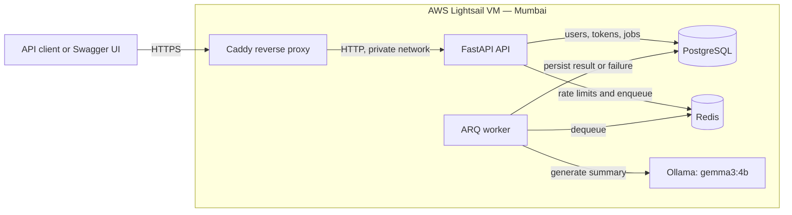

# Production AI REST API — Deployment Architecture

**Status:** Target architecture for Milestone 4. It is not a claim that a live
deployment exists.

## Request and job flow

1. A client reaches the API through Caddy over HTTPS.
2. The API authenticates the request, checks the per-user Redis rate limit, and
   persists a `queued` job in PostgreSQL.
3. The API enqueues the persisted job in Redis and returns the job ID with an
   `X-Request-ID` correlation header.
4. The ARQ worker consumes the job, calls Ollama, and persists a terminal
   `completed` or `failed` state.
5. The client polls the authenticated job endpoint for the result.

## Exposure and persistence

| Component | Publicly reachable | Persistent data | Notes |
|---|---|---|---|
| Caddy | Yes: ports 80 and 443 | TLS state | Terminates HTTPS and proxies only to the API. |
| FastAPI API | No | No | Exposed through Caddy only. |
| ARQ worker | No | No | Runs as a separate process from the API. |
| PostgreSQL | No | Yes | Stores users, refresh-token records, and summary jobs. |
| Redis | No | Yes | Provides the queue and rate-limit counters. |
| Ollama | No | Yes | Stores the downloaded local model. |

## Deployment boundaries

- Run database migrations as an explicit release step before replacing API or
  worker containers.
- Keep `JWT_SECRET`, database credentials, and any future provider credentials
  in the server-only environment file; never commit them.
- Publish only Caddy's HTTP/HTTPS ports. PostgreSQL, Redis, Ollama, and the API
  remain on the internal Docker network.
- A single VM is appropriate for a portfolio deployment. It is not high
  availability: a VM outage makes the whole service unavailable.
